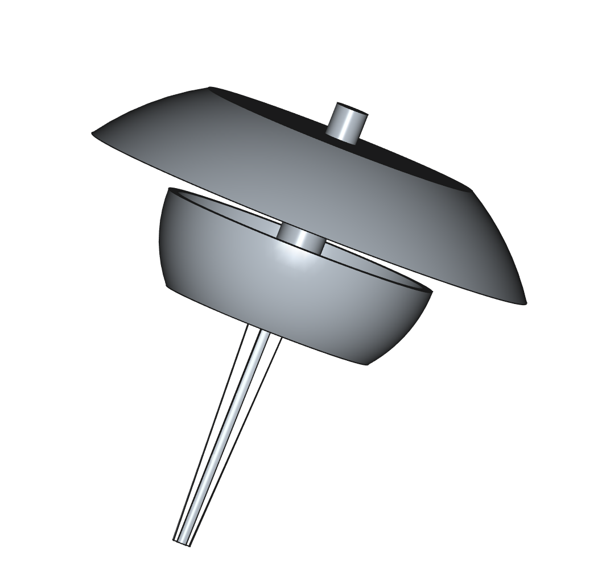

## 🐌 Snail Bait Dispenser

A practical 3D-printable container for slug and snail bait (pellets), designed to keep the bait dry and protected from rain while remaining accessible to pests. Perfect for gardens, vegetable patches, and flowerbeds.

---

### 📦 What's Included

* STL files ready to print
* Preview image
* Print and usage instructions

---

### 🖨️ Print Settings

* **Recommended material:** PLA or PETG (for outdoor resistance)
* **Layer height:** 0.2 mm
* **Infill:** 15–20%
* **Supports:** Not required
* **Estimated print time:** \~2 hours

---

### 🛠️ Assembly Instructions

1. Print both parts (dome and bait cup).
2. Fill the lower cup with slug bait pellets.
3. Place the top dome over the cup.
4. Push the dispenser into the soil using the built-in spike.

---

### 🪴 How to Use

* Place near the plants you want to protect.
* The dome design keeps rain out and limits access to non-target animals.
* Easily refill by lifting the top.

---

### 📜 License

Released under the **CC BY-SA 4.0 License** – you’re free to use, modify, and share it, even commercially, as long as you give proper credit and share alike.
